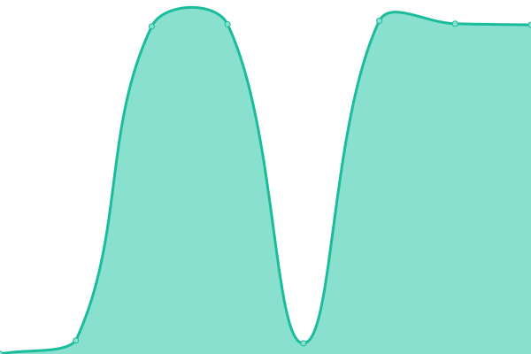

# [📈 Live Status](https://upptime.github.io/upptime): <!--live status--> **🟧 Partial outage**

This repository contains the open-source uptime monitor and status page for [Upptime](https://upptime.js.org), powered by [Upptime](https://github.com/upptime/upptime).

With [Upptime](https://upptime.js.org), you can get your own unlimited and free uptime monitor and status page, powered entirely by a GitHub repository. We use [Issues](https://github.com/upptime/upptime/issues) as incident reports, [Actions](https://github.com/chequeado/status/actions) as uptime monitors, and [Pages](https://upptime.github.io/upptime) for the status page.

<!--start: status pages-->
<!-- This summary is generated by Upptime (https://github.com/upptime/upptime) -->
<!-- Do not edit this manually, your changes will be overwritten -->
<!-- prettier-ignore -->
| URL | Status | History | Response Time | Uptime |
| --- | ------ | ------- | ------------- | ------ |
|  [Chequeado](https://www.chequeado.com) | 🟩 Up | [chequeado.yml](https://github.com/chequeado/status/commits/HEAD/history/chequeado.yml) | 

 2282ms
     
 | 

<a href="https://chequeado.github.io/status/history/chequeado">100.00%</a>
    

|  [Chequeabot](https://chequeabot.com) | 🟩 Up | [chequeabot.yml](https://github.com/chequeado/status/commits/HEAD/history/chequeabot.yml) | 

 280ms
     
 | 

<a href="https://chequeado.github.io/status/history/chequeabot">51.97%</a>
    

|  [El abridor](https://elabridor.chequeado.com/) | 🟩 Up | [el-abridor.yml](https://github.com/chequeado/status/commits/HEAD/history/el-abridor.yml) | 

 290ms
     
 | 

<a href="https://chequeado.github.io/status/history/el-abridor">100.00%</a>
    

|  [test04](https://04.chequeado.com/) | 🟥 Down | [test04.yml](https://github.com/chequeado/status/commits/HEAD/history/test04.yml) | 

 0ms
     
 | 

<a href="https://chequeado.github.io/status/history/test04">0.00%</a>
    

<!--end: status pages-->

[**Visit our status website →**](https://upptime.github.io/upptime)

## 📄 License

- Powered by: [Upptime](https://github.com/upptime/upptime)
- Code: [MIT](./LICENSE) © [Upptime](https://upptime.js.org)
- Data in the `./history` directory: [Open Database License](https://opendatacommons.org/licenses/odbl/1-0/)
